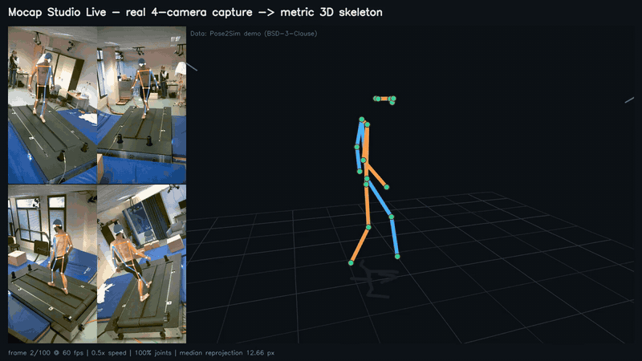

# Mocap Studio Web

**Local multi-camera motion capture: real-time 2D + metric 3D pose estimation, and a workstation for reviewing and correcting it.**

Mocap Studio turns synchronized videos from 2–6 calibrated cameras into traceable 3D motion. Footage, model inference and results stay on your computer; no cloud account is required. The repository contains two applications that share one local engine:

| | Real-time desktop app | Review workstation |
| --- | --- | --- |
| Purpose | Process whole takes fast and watch 2D + 3D pose live | Inspect and hand-correct individual frames |
| Temporal model | Kalman filter live, full-take RTS smoothing when saved | None (evidence-only, per-frame) |
| Inference | GPU (Apple CoreML / CUDA / DirectML) or CPU, auto-selected | CPU |
| Start | `python3 scripts/manage.py desktop` | `python3 scripts/manage.py start` |

## Real-time desktop app



**Real multi-camera 3D demo** ([MP4](docs/media/realtime-3d-demo.mp4)). A real person balancing on a platform was filmed by 4 synchronized, calibrated cameras (the public [Pose2Sim](https://github.com/perfanalytics/pose2sim) demo capture, 1080×1920 at 60 fps). Left: the four camera views with the reconstructed 3D pose projected back onto each image. Right: the metric 3D skeleton in meters on a 0.5 m floor grid, with the camera positions. Shown at 0.5× speed.

Measured on this capture, balanced preset with flip test-time augmentation:

| Measure | Result |
| --- | --- |
| Frames with every joint reconstructed | 100 % (100 / 100) |
| Median reprojection error | 12.7 px on 1080×1920 images |
| Limb-length variation over the take | 1.5–5 % coefficient of variation |
| Limb lengths (upper arm / forearm / thigh / shank) | 0.27 / 0.26 / 0.41 / 0.38 m |
| Processing speed | 2.6 fps for 4 cameras on a 2-core cloud CPU without GPU |

A single-camera real-footage 2D example is included as well ([MP4](docs/media/badminton-pose2d-demo.mp4), made with `scripts/pose2d_video.py`). One camera gives 2D only; 3D needs two or more calibrated cameras.

<details>
<summary>Reproduce the 3D demo</summary>

```bash
git clone --depth 1 https://github.com/perfanalytics/pose2sim /tmp/pose2sim
V=/tmp/pose2sim/Pose2Sim/Demo_SinglePerson/videos
python scripts/process_capture.py examples/pose2sim_demo_calibration.json results --flip \
  --video cam1=$V/cam01.mp4 --video cam2=$V/cam02.mp4 --video cam3=$V/cam03.mp4 --video cam4=$V/cam04.mp4
python scripts/render_3d_demo.py results/capture_* demo.mp4 --slowmo 0.5 --loops 3 \
  --video cam1=$V/cam01.mp4 --video cam2=$V/cam02.mp4 --video cam3=$V/cam03.mp4 --video cam4=$V/cam04.mp4
```

`examples/pose2sim_demo_calibration.json` was converted from the capture's Qualisys calibration with `scripts/import_qualisys_calibration.py`. You can also open the calibration and the four videos in the desktop app.

</details>

Choose a calibration and one synchronized video per camera, press **Start**, and the app streams every processed frame: each camera view with its 2D skeleton and the 3D skeleton in an orbitable viewer. When the take is finished, it is re-smoothed using past *and* future frames; replay the final result and save it to your computer.

### Start

```bash
python3 scripts/manage.py setup      # once: dependencies, models, native window, macOS app bundle
python3 scripts/manage.py desktop    # or double-click dist/Mocap Studio.app on macOS
```

`python3 scripts/manage.py build-app --install` copies the app to `~/Applications`. Without the optional `pywebview` package the app opens in a Chrome/Edge app window or the default browser (`desktop --browser` forces this).

### What makes it fast and accurate

- **GPU inference with automatic fallback.** Each network is benchmarked on CoreML / CUDA / DirectML and on the CPU when it loads; the faster one is used. All cameras are batched into one pose-network call per frame.
- **Tracking instead of detecting every frame.** Each camera follows the actor with the previous keypoints, extrapolated by their velocity and padded for fast motion such as sprinting. The person detector runs asynchronously on a staggered schedule and immediately when a track is lost, so it never stalls the frame loop.
- **Every frame is processed.** No frame skipping; higher capture frame rates directly improve the temporal model.
- **Robust multi-view geometry.** All joints are solved together (weighted DLT + Gauss–Newton on pixel error). A disagreeing camera is dropped for that joint instead of losing the joint, and each joint gets a 3×3 covariance so narrow-angle depth is trusted less. Left/right confusions (common for legs while running) are repaired per camera against the predicted 3D pose.
- **Temporal model.** A constant-acceleration Kalman filter per joint with outlier gating drives the live view; a Rauch–Tung–Striebel smoother over the whole take produces the saved result. Optional flip test-time augmentation, sub-pixel keypoint decoding, and a choice of models up to RTMPose-X 384×288 with feet (Halpe-26).
- **No playback stalls.** Decoding prefetches on one thread per camera; the UI keeps an adaptive jitter buffer and slows playback smoothly if processing is slower than real time (or follows the live edge on request).

### Accuracy evidence

`python3 scripts/manage.py benchmark --cams 4 --fps 60` reproduces the table below. The ground truth is a synthetic runner; 2D errors follow a deliberately pessimistic detector model (σ = 2.5 px noise, 3 % gross outliers, 3 % dropouts, bursts of left/right leg swaps).

| 4 cameras, 60 fps | 3D coverage | Mean error | p95 | Jitter | Solve time / frame |
| --- | --- | --- | --- | --- | --- |
| Earlier per-frame solver | 91.8 % | 8.8 mm | 16.8 mm | 26.4 mm | ~650 ms |
| Real-time triangulation | 100 % | 9.2 mm | 16.3 mm | 37.4 mm | ~3 ms |
| + live Kalman filter (displayed) | 100 % | 7.0 mm | 13.0 mm | 13.1 mm | |
| + full-take smoothing (saved) | 100 % | **3.7 mm** | **7.1 mm** | **2.4 mm** | |

This validates the geometry and temporal model against a known error model. It does not measure the 2D network on real people; real footage adds model bias, synchronization and calibration error. Validate against a reference (markers or known segment lengths) before quoting accuracy for a rig. Throughput depends on the machine, camera count and model preset and is shown live in the app.

### Outputs (saved to a folder you choose)

`pose3d.json` (smoothed, raw and live 3D, per-joint uncertainty, per-camera 2D keypoints and reprojections, calibration, quality report) · `pose3d.csv` · `pose2d_<camera>.csv` · `pose3d.trc` (Y-up millimetres for OpenSim / Blender) · optional `<camera>_overlay.mp4` · `report.json`.

### Current limits

One tracked actor; videos must already be synchronized at a constant frame rate; file input only (live camera capture is not yet included); joint positions only (no joint rotations or BVH/FBX retargeting yet). See [docs/REALTIME.md](docs/REALTIME.md) for details.

## Offline review workstation

### Run it in three commands

From the repository root:

Use **Python 3.12 or 3.13**, Node.js 22+ and npm. The validated development machine used Python 3.13.5 and Node.js 24.14.1 on macOS arm64.

```bash
python3 scripts/manage.py setup
python3 scripts/manage.py doctor
python3 scripts/manage.py start
```

Open **http://127.0.0.1:8765**. On Windows, use `python` if that is your Python command. `setup` installs the locked Python environment, builds the browser UI, and downloads verified weights. `start` binds only to the local workstation. Use `start --port 8766` if another program already uses port 8765.

For an editor-only installation with the synthetic demo, run `setup --skip-models`. Install the models later with `.venv/bin/python scripts/download_models.py` (Windows: `.venv\Scripts\python.exe`). Internet access is needed during setup; operation is local afterward.

<details>
<summary>Equivalent manual setup</summary>

```bash
python3 -m venv .venv
source .venv/bin/activate
python -m pip install -r requirements.lock.txt
python scripts/download_models.py
npm --prefix frontend ci
npm --prefix frontend run build
python -m uvicorn backend.app:app --host 127.0.0.1 --port 8765
```

On Windows, activate with `.venv\Scripts\Activate.ps1` instead.

</details>

Model downloads are needed once and cached under `.local/models/` by default. The downloader verifies the ONNX weights against the recorded SHA-256 hashes. The combined downloads are approximately 140 MB compressed. You can run the synthetic demo without downloading models.

The UI and the API share the same local server. Keep the terminal running while using the application. There is no automatic startup service.

#### Development

Use two terminals with the virtual environment active:

```bash
# Terminal 1, repository root
python -m uvicorn backend.app:app --reload --host 127.0.0.1 --port 8765

# Terminal 2, repository root
npm --prefix frontend run dev
```

Open Vite's displayed local URL. The dev server proxies `/api` to port 8765. React fast refresh updates the UI while editing.

```bash
python3 scripts/manage.py test

# Optional contributor lint/format checks
python -m pip install -r requirements-dev.txt
ruff check backend scripts tests desktop
ruff format --check backend scripts tests desktop
```

### Your first capture

1. **Calibrate the rig.** In Camera calibration, provide at least 12 synchronized chessboard images for every camera. Use the measured square size in meters. The application accepts a calibration only after intrinsic fit, stereo fit, and board-pose diversity checks pass.
2. **Import synchronized media.** Select one video or a numbered image sequence for each camera and attach the corresponding calibration. Every video must have matching constant FPS and frame-zero alignment; every image must use the calibration resolution.
3. **Run pose analysis.** The job runs locally with progress and cancellation. If several people appear, choose the same person in each camera panel before reviewing 3D motion.
4. **Review and refine.** Use the review queue to visit flagged frames. Drag a joint, use the precise pixel controls, or place a missing observation. Orange crosses show the current 3D reprojection. Saved labels are never silently overwritten by a later model run.
5. **Deliver the result.** Download a project backup when you need to continue work later. Export 3D motion JSON when you need timestamped joint positions and quality evidence for another tool.

For a guided dry run, open the included synthetic demo and use frame 20 to correct the deliberately offset right wrist in cam2.

#### Capture requirements

- Videos must be synchronized, constant-FPS, and aligned at frame zero. This release does not measure or repair synchronization. Variable-frame-rate videos should be converted to constant FPS first.
- All video cameras in a session must report matching FPS. Camera image resolution must match that camera's calibration exactly.
- For images, provide the true source FPS and shared numbered filenames such as `frame001.jpg`, `frame004.jpg`. Gaps remain gaps in time. Files can be selected separately for each camera, so camera labels do not have to appear in filenames.
- MVP limits: 300 sampled frames, 500 MB per upload, and 450 MB of extracted camera images per session. Video stride reduces sampling density while preserving original frame timestamps.
- The chessboard builder currently requires equal image dimensions across cameras. Imported calibrated cameras may have different resolutions.
- Keep one intended actor in the capture volume when possible. Multiple-person selections are per frame and require operator review.

### Data and accuracy boundaries

The review workstation delivers the complete local operator workflow. It is not yet a metrologically validated capture system. Real RTMPose 2D inference was verified on a public image; real synchronized multi-camera human capture accuracy has not yet been benchmarked.

3D positions use calibrated multi-view geometry, not an inferred single-camera body shape. A joint needs at least two usable views. In the review workstation, missing joints stay `null`; there is no automatic gap filling, motion smoothing, bone-length enforcement, or foot locking. (The real-time app above adds an explicit, reported temporal model.) This preserves evidence and avoids introducing the timing/contact defects found in the original scripts.

Reprojection error measures consistency with image observations. It does not certify depth accuracy, actor identity, synchronization, anatomical correctness, or calibration coverage. Inspect accepted/excluded views as well as the rendered skeleton.

The output is COCO-17 body pose plus derived pelvis, neck, spine, and head positions. Detailed fingers, heels/toes, and production-character retargeting are outside this release. A head-to-neck segment is displayed using the shoulder midpoint; it is a visual derived segment, not a separately detected landmark.

The 3D grid is a reference aid. With `world_frame: camera`, its height follows the observed skeleton and it is **not a measured floor**. A `z_up` calibration uses the supplied world Z=0 plane.

## Repository layout

```text
backend/                  Review workstation: FastAPI routes, calibration, geometry, model adapter, storage
backend/realtime/         Real-time engine: ONNX models, tracking, triangulation, temporal model, export, API
backend/realtime/ui/      Desktop UI (vanilla JS, three.js vendored; no build step)
desktop/launch.py         Desktop launcher (native window via pywebview, browser fallback)
frontend/src/             Review workstation UI: typed React editor, camera interaction, Three.js viewer
tests/                    Geometry, workflow and real-time pipeline regression tests
scripts/                  Setup/start/doctor/desktop, model downloader, headless processing, demo rendering,
                          Qualisys calibration import, single-camera 2D overlay, benchmark, macOS app builder
docs/                     Architecture, calibration format, validation evidence, real-time app guide
examples/                 Calibration schema example and the converted Pose2Sim demo calibration
.github/workflows/ci.yml  Backend/frontend tests, lint, formatting and build
requirements.txt          Direct dependency versions
requirements.lock.txt     Tested complete Python dependency set
requirements-desktop.txt  Optional native window (pywebview)
requirements-dev.txt      Contributor lint dependency
frontend/package-lock.json
.local/                   Ignored recordings, saved sessions, model weights
dist/                     Ignored locally built "Mocap Studio.app"
```

Both applications share one local server: the review workstation at `/` and the real-time app at `/live/`. Recordings, model binaries, environments, caches, exports and generated builds are ignored by Git.

## Documentation

- [Real-time desktop app: workflow, pipeline, accuracy benchmark, outputs](docs/REALTIME.md)

- [MVP scope and acceptance criteria](docs/MVP_ACCEPTANCE.md)
- [Validation results](docs/VALIDATION.md)
- [Architecture and data invariants](docs/ARCHITECTURE.md)
- [Calibration schema and capture guidance](docs/CALIBRATION.md)
- [Operator troubleshooting](docs/OPERATIONS.md)

## Configuration

| Variable | Purpose |
| --- | --- |
| `MOCAP_DATA_DIR` | Review-workstation session storage (default `.local/sessions`) |
| `MOCAP_MODEL_DIR` | Model weights (default `.local/models`) |
| `MOCAP_EXPORT_DIR` | Default save folder of the real-time app (default `~/Documents/MocapStudio/Exports`) |
| `MOCAP_PORT` | Preferred port of the desktop launcher (default 8765; a free port is chosen if busy) |
| `MOCAP_PYTHON` | Existing Python environment for the launchers |

Set overrides as environment variables; `.env.example` documents them but is not loaded automatically.

The server is intended for a **single local workstation** and binds to loopback. It rejects requests whose `Host` or `Origin` is not local (protection against cross-site requests and DNS rebinding). It has no authentication, multi-user isolation, remote deployment configuration, or public hosting setup.

# Third-Party Notices

This project uses and/or downloads third-party model weights and libraries. The respective code and model weights are subject to their own licenses.
** RTMPose and YOLOX Models
The RTMPose-M and YOLOX-M model checkpoints downloaded and used by this application are provided by the [OpenMMLab](https://github.com/open-mmlab) and [RTMLib](https://github.com/Tau-J/rtmlib) projects. 

These models and their associated source code are generally licensed under the **Apache License 2.0**. 
- MMPose / RTMPose: [https://github.com/open-mmlab/mmpose/blob/main/LICENSE](https://github.com/open-mmlab/mmpose/blob/main/LICENSE)
- RTMLib: [https://github.com/Tau-J/rtmlib/blob/main/LICENSE](https://github.com/Tau-J/rtmlib/blob/main/LICENSE)

By using the automated downloader script in this project, you are retrieving these weights from their respective release channels. Ensure you comply with the Apache 2.0 license terms if you intend to redistribute these weights.

The real-time app can also download the optional RTMPose-X (384×288) and Halpe-26 (body + feet) checkpoints from the same OpenMMLab release channel on request. It vendors [three.js](https://github.com/mrdoob/three.js) r180 (MIT, see `backend/realtime/ui/vendor/THREE_LICENSE.txt`) and uses [pywebview](https://github.com/r0x0r/pywebview) (BSD-3-Clause) for the native window when installed. See [THIRD_PARTY_NOTICES.md](THIRD_PARTY_NOTICES.md).

# License

Copyright (c) 2026 Dilip Goswami

Permission is hereby granted, free of charge, to any person obtaining a copy of this software and associated documentation files (the "Software"), to deal in the Software without restriction, including without limitation the rights to use, copy, modify, merge, publish, distribute, sublicense, and/or sell copies of the Software, and to permit persons to whom the Software is furnished to do so, subject to the following conditions:

